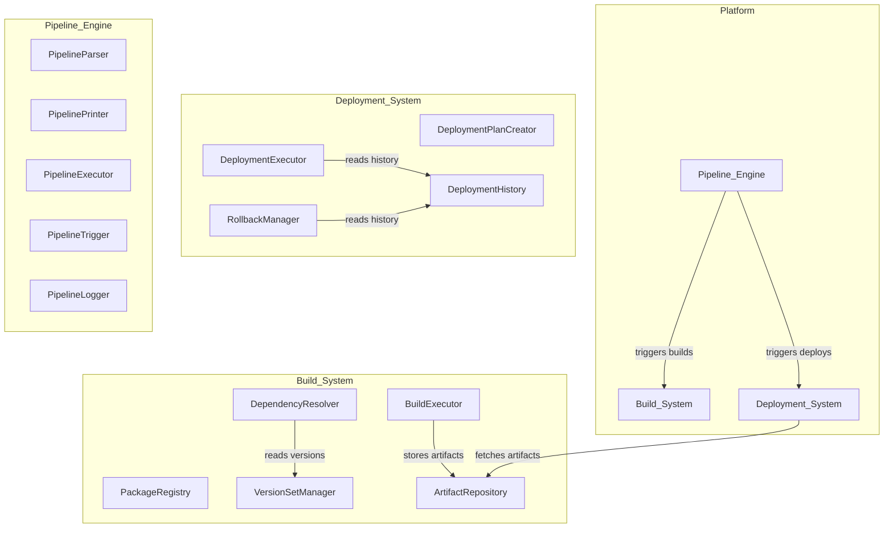

# Design Document: Build Platform

## Overview

This document describes the technical design for an internal build and deployment platform composed of three subsystems:

1. **Build_System** — Package registration, dependency resolution, build execution, version set management, and artifact storage.
2. **Deployment_System** — Deployment plan creation, ordered deployment execution, and rollback.
3. **Pipeline_Engine** — Pipeline definition parsing/printing (with round-trip guarantee), execution with parallel stages, automatic triggering, and observability.

The platform is implemented as a TypeScript monorepo. Each subsystem is a self-contained module with clearly defined interfaces. Persistence is backed by an in-memory store with a pluggable storage interface so it can be swapped for a database later.

### Key Design Decisions

| Decision | Rationale |
|---|---|
| TypeScript | Strong typing, broad ecosystem, good for domain modeling |
| In-memory store behind interface | Fast iteration now, swap to DB later without code changes |
| DAG-based dependency resolution | Guarantees acyclic, deterministic builds |
| Immutable Version_Sets | Reproducibility — once created, a version set never changes |
| Pipeline DSL with round-trip parsing | Enables programmatic manipulation and human-readable configs |
| Ordered deployment with halt-on-failure | Prevents cascading bad deployments |

## Architecture



The three subsystems communicate through well-defined interfaces. The Pipeline_Engine orchestrates workflows that call into Build_System and Deployment_System. The Deployment_System reads artifacts from the Artifact_Repository. The Build_System's DependencyResolver consults the VersionSetManager for version pinning.

## Components and Interfaces

### Build_System

#### PackageRegistry

Responsible for registering, validating, and storing package manifests.

```typescript
interface PackageRegistry {
  register(manifest: PackageManifest): Result<Package, RegistrationError>;
  get(packageId: string): Package | undefined;
  getByName(name: string): Package | undefined;
  list(): Package[];
}
```

- Validates manifest completeness (name, version, at least one build step).
- Rejects duplicate names.
- Validates that all declared dependencies exist in the registry.
- Assigns a unique identifier on successful registration.

#### DependencyResolver

Resolves the full transitive dependency graph for a package.

```typescript
interface DependencyResolver {
  resolve(packageId: string, versionSet?: VersionSet): Result<DependencyGraph, ResolutionError>;
}
```

- Builds a DAG of all transitive dependencies.
- Detects cycles and reports the cycle path.
- Uses the active VersionSet to pin dependency versions when multiple versions exist.
- Deterministic: same inputs always produce the same graph.

#### BuildExecutor

Executes build steps and produces artifacts.

```typescript
interface BuildExecutor {
  build(packageId: string, versionSet?: VersionSet): Promise<Result<BuildArtifact, BuildError>>;
}
```

- Executes build steps in declared order.
- Halts on first failure, records the failing step and reason.
- Isolates concurrent builds (no shared mutable state between builds).
- Caches: returns existing artifact if no source/dependency changes detected.
- On success, publishes artifact to ArtifactRepository.

#### VersionSetManager

Creates and manages immutable version sets.

```typescript
interface VersionSetManager {
  create(spec: VersionSetSpec): Result<VersionSet, VersionSetError>;
  get(versionSetId: string): VersionSet | undefined;
  validate(versionSetId: string): Result<void, VersionSetError>;
}
```

- Validates all referenced package versions exist in ArtifactRepository.
- Version sets are immutable after creation.
- Rejects builds against a version set with missing/deleted artifact versions.

#### ArtifactRepository

Stores and retrieves build artifacts with metadata.

```typescript
interface ArtifactRepository {
  publish(artifact: BuildArtifact, metadata: ArtifactMetadata): Result<void, ArtifactError>;
  get(packageName: string, version: string): Result<StoredArtifact, ArtifactError>;
  delete(packageName: string, version: string): Result<void, ArtifactError>;
  exists(packageName: string, version: string): boolean;
}
```

- Stores artifact with metadata: package name, version, build timestamp, source commit hash.
- Returns descriptive error for missing artifacts.
- Retains all artifacts unless explicitly deleted.

### Deployment_System

#### DeploymentPlanCreator

Validates and creates deployment plans.

```typescript
interface DeploymentPlanCreator {
  create(spec: DeploymentPlanSpec): Result<DeploymentPlan, PlanError>;
}
```

- Validates all referenced artifacts exist in ArtifactRepository.
- Validates all referenced deployment targets are registered and reachable.
- Supports ordered deployment across multiple targets.
- Rejects plans with invalid references, listing all issues.

#### DeploymentExecutor

Executes deployment plans in order.

```typescript
interface DeploymentExecutor {
  execute(plan: DeploymentPlan): Promise<Result<DeploymentResult, DeploymentError>>;
  getStatus(deploymentId: string): DeploymentStatus;
}
```

- Deploys artifacts to targets in the order specified by the plan.
- Reports per-target status: pending, in-progress, succeeded, failed.
- Halts on first target failure, notifies operator.
- Records deployed artifact version and timestamp on success.

#### RollbackManager

Handles rollback to previous artifact versions.

```typescript
interface RollbackManager {
  rollback(targetId: string): Promise<Result<DeploymentRecord, RollbackError>>;
  getHistory(targetId: string, limit?: number): DeploymentRecord[];
}
```

- Redeploys the previously recorded artifact version.
- Maintains at least 10 deployment records per target.
- Rejects rollback if no previous deployment exists.
- Records rollback as a new deployment history entry.

### Pipeline_Engine

#### PipelineParser & PipelinePrinter

Parses pipeline definition text into structured objects and prints them back.

```typescript
interface PipelineParser {
  parse(input: string): Result<PipelineDefinition, ParseError>;
}

interface PipelinePrinter {
  print(definition: PipelineDefinition): string;
}
```

- Parser validates stage/step structure and action types (build, test, deploy, custom).
- Rejects definitions with syntax errors or unknown action types.
- Round-trip guarantee: `parse(print(parse(input))) ≡ parse(input)` for all valid inputs.

#### PipelineExecutor

Executes pipeline runs.

```typescript
interface PipelineExecutor {
  execute(definitionId: string, commitRef?: string): Promise<Result<PipelineRun, PipelineError>>;
  getStatus(runId: string): PipelineRunStatus;
}
```

- Creates a PipelineRun and executes stages in declared order.
- Executes parallel-marked steps concurrently within a stage.
- Halts on step failure, records failure, notifies operator.
- Marks run as succeeded when all stages complete, records timestamp.
- Provides real-time status per stage and step.

#### PipelineTrigger

Manages automatic and manual pipeline triggering.

```typescript
interface PipelineTrigger {
  onCommit(repo: string, branch: string, commitRef: string): Promise<void>;
  manualTrigger(definitionId: string, commitRef?: string): Promise<Result<PipelineRun, TriggerError>>;
  setConcurrencyPolicy(definitionId: string, allowParallel: boolean): void;
}
```

- Auto-triggers associated pipeline on commit push to monitored branch.
- Manual trigger uses specified commit or latest on configured branch.
- Prevents concurrent runs for same definition unless explicitly enabled.

#### PipelineLogger

Persists structured logs for pipeline runs.

```typescript
interface PipelineLogger {
  log(runId: string, entry: LogEntry): void;
  getRunLog(runId: string): PipelineRunLog;
  getDefinitionHistory(definitionId: string): PipelineRunLog[];
}
```

- Logs status and duration per stage and step.
- Returns history in reverse chronological order.

## Data Models

```typescript
// ─── Build_System Models ───

interface PackageManifest {
  name: string;
  version: string;
  dependencies: DependencyRef[];
  buildSteps: BuildStep[];
  metadata?: Record<string, string>;
}

interface DependencyRef {
  packageName: string;
  versionConstraint?: string; // resolved via VersionSet if ambiguous
}

interface Package {
  id: string;           // unique identifier assigned at registration
  name: string;
  version: string;
  dependencies: DependencyRef[];
  buildSteps: BuildStep[];
  registeredAt: Date;
}

interface BuildStep {
  name: string;
  command: string;
  order: number;
}

interface DependencyGraph {
  root: string;         // package id
  nodes: Map<string, DependencyNode>;
}

interface DependencyNode {
  packageId: string;
  version: string;
  dependencies: string[]; // package ids
}

interface BuildArtifact {
  packageName: string;
  version: string;
  data: Buffer | Uint8Array;
}

interface ArtifactMetadata {
  buildTimestamp: Date;
  sourceCommitHash: string;
}

interface StoredArtifact {
  artifact: BuildArtifact;
  metadata: ArtifactMetadata;
  publishedAt: Date;
}

interface VersionSetSpec {
  name: string;
  versions: Map<string, string>; // packageName -> version
}

interface VersionSet {
  id: string;
  name: string;
  versions: Map<string, string>;
  createdAt: Date;
  frozen: true; // always true — immutable after creation
}

// ─── Deployment_System Models ───

interface DeploymentTarget {
  id: string;
  name: string;
  environment: string;   // e.g. "staging", "production"
  reachable: boolean;
}

interface DeploymentPlanSpec {
  artifacts: ArtifactRef[];
  targets: TargetDeployment[];
}

interface ArtifactRef {
  packageName: string;
  version: string;
}

interface TargetDeployment {
  targetId: string;
  artifactRefs: ArtifactRef[];
  order: number;
}

interface DeploymentPlan {
  id: string;
  targets: TargetDeployment[];
  createdAt: Date;
}

type DeploymentTargetStatus = "pending" | "in-progress" | "succeeded" | "failed";

interface DeploymentStatus {
  deploymentId: string;
  targetStatuses: Map<string, DeploymentTargetStatus>;
}

interface DeploymentRecord {
  id: string;
  targetId: string;
  artifactVersion: string;
  packageName: string;
  deployedAt: Date;
  deployedBy: string;
  outcome: "succeeded" | "failed" | "rolled-back";
}

interface DeploymentResult {
  deploymentId: string;
  records: DeploymentRecord[];
}

// ─── Pipeline_Engine Models ───

type ActionType = "build" | "test" | "deploy" | "custom";

interface StepDefinition {
  name: string;
  action: ActionType;
  script?: string;       // for custom action
  parallel?: boolean;    // if true, can run concurrently with other parallel steps in same stage
}

interface StageDefinition {
  name: string;
  steps: StepDefinition[];
}

interface PipelineDefinition {
  id: string;
  name: string;
  stages: StageDefinition[];
  trigger?: TriggerConfig;
}

interface TriggerConfig {
  repository: string;
  branch: string;
  allowParallelRuns: boolean;
}

type StepStatus = "pending" | "running" | "succeeded" | "failed" | "skipped";
type StageStatus = "pending" | "running" | "succeeded" | "failed" | "skipped";
type RunStatus = "pending" | "running" | "succeeded" | "failed";

interface PipelineRun {
  id: string;
  definitionId: string;
  commitRef: string;
  status: RunStatus;
  stages: StageRun[];
  startedAt: Date;
  completedAt?: Date;
}

interface StageRun {
  stageName: string;
  status: StageStatus;
  steps: StepRun[];
  startedAt?: Date;
  completedAt?: Date;
}

interface StepRun {
  stepName: string;
  action: ActionType;
  status: StepStatus;
  startedAt?: Date;
  completedAt?: Date;
  error?: string;
}

interface LogEntry {
  timestamp: Date;
  level: "info" | "warn" | "error";
  message: string;
  stageIndex?: number;
  stepIndex?: number;
}

interface PipelineRunLog {
  runId: string;
  definitionId: string;
  entries: LogEntry[];
  summary: {
    status: RunStatus;
    startedAt: Date;
    completedAt?: Date;
    stageDurations: Map<string, number>;
    stepDurations: Map<string, number>;
  };
}

// ─── Shared ───

type Result<T, E> = { ok: true; value: T } | { ok: false; error: E };
```

## Correctness Properties

*A property is a characteristic or behavior that should hold true across all valid executions of a system — essentially, a formal statement about what the system should do. Properties serve as the bridge between human-readable specifications and machine-verifiable correctness guarantees.*

### Property 1: Valid manifest registration produces unique IDs

*For any* valid PackageManifest (with name, version, and at least one build step), registering it with the PackageRegistry should succeed and return a Package with a unique identifier that is distinct from all previously assigned identifiers.

**Validates: Requirements 1.1**

### Property 2: Duplicate package name rejection

*For any* registered Package, attempting to register another PackageManifest with the same name should fail with an error indicating the name conflict.

**Validates: Requirements 1.2**

### Property 3: Invalid manifest rejection

*For any* PackageManifest that is missing a name, version, or has zero build steps, OR references a dependency not present in the registry, registration should fail and the error should list all validation issues (missing fields or unresolved dependencies).

**Validates: Requirements 1.3, 1.4**

### Property 4: Transitive dependency completeness

*For any* Package with dependencies, the resolved DependencyGraph should contain every transitive dependency reachable from the root package — i.e., for every node in the graph, all of its declared dependencies should also be nodes in the graph.

**Validates: Requirements 2.1**

### Property 5: Cycle detection in dependency graph

*For any* set of Packages whose dependency relationships form a cycle, the DependencyResolver should reject resolution and the error should contain the cycle path.

**Validates: Requirements 2.2**

### Property 6: Deterministic dependency resolution

*For any* Package and VersionSet, resolving the DependencyGraph twice with the same inputs should produce identical graphs.

**Validates: Requirements 2.4**

### Property 7: Build step execution order

*For any* Package with N build steps, a successful build should execute steps in the order declared in the PackageManifest (step with order i executes before step with order i+1).

**Validates: Requirements 3.1**

### Property 8: Build halts on step failure

*For any* Package build where step K fails (1 ≤ K ≤ N), steps K+1 through N should not execute, and the build result should identify step K as the failing step with a failure reason.

**Validates: Requirements 3.3**

### Property 9: Build caching idempotence

*For any* Package with no source or dependency changes since the last successful build, triggering a build should return the same BuildArtifact without re-executing build steps.

**Validates: Requirements 3.5**

### Property 10: Version set immutability

*For any* created VersionSet, reading it at any subsequent point should return the exact same set of package-version mappings as at creation time.

**Validates: Requirements 4.2**

### Property 11: Version set governs dependency resolution

*For any* build request with a VersionSet, every dependency in the resolved DependencyGraph should use the version specified in that VersionSet.

**Validates: Requirements 2.3, 4.3**

### Property 12: Version set validation against artifact repository

*For any* VersionSetSpec, creation should succeed only if every referenced package-version pair exists in the ArtifactRepository. If any referenced artifact has been deleted, builds using that VersionSet should fail and report the missing versions.

**Validates: Requirements 4.1, 4.4**

### Property 13: Artifact storage round-trip

*For any* successfully built artifact published to the ArtifactRepository, retrieving it by package name and version should return the same artifact data and complete metadata (package name, version, build timestamp, source commit hash). The artifact should remain retrievable until explicitly deleted.

**Validates: Requirements 5.1, 5.2, 5.4**

### Property 14: Deployment plan validation

*For any* DeploymentPlanSpec, creation should succeed only if all referenced BuildArtifacts exist in the ArtifactRepository AND all referenced DeploymentTargets are registered and reachable. If any reference is invalid, the error should list all invalid references.

**Validates: Requirements 6.1, 6.2, 6.3**

### Property 15: Deployment execution order

*For any* DeploymentPlan with multiple targets ordered by their `order` field, execution should deploy to targets in ascending order — target with order i is deployed before target with order i+1.

**Validates: Requirements 6.4, 7.1**

### Property 16: Deployment halts on target failure

*For any* DeploymentPlan where deployment to target K fails, targets with order > K should not be deployed.

**Validates: Requirements 7.3**

### Property 17: Rollback redeploys previous version

*For any* DeploymentTarget with at least two deployment records, rolling back should redeploy the artifact version from the deployment record immediately preceding the current one.

**Validates: Requirements 8.1**

### Property 18: Deployment history minimum retention

*For any* DeploymentTarget, the deployment history should retain at least the last 10 records (or all records if fewer than 10 deployments have occurred).

**Validates: Requirements 8.2**

### Property 19: Rollback creates history entry

*For any* successful rollback, the deployment history for that target should grow by exactly one entry, and the new entry should reflect the rolled-back artifact version.

**Validates: Requirements 8.4**

### Property 20: Pipeline definition round-trip

*For any* valid PipelineDefinition object, `parse(print(definition))` should produce an object equivalent to the original definition. Equivalently, for any valid pipeline definition string, `parse(print(parse(input)))` should equal `parse(input)`.

**Validates: Requirements 9.1, 9.4, 9.5**

### Property 21: Pipeline parser rejects invalid action types

*For any* pipeline definition string containing a step with an action type not in {build, test, deploy, custom}, the parser should reject it with a descriptive error.

**Validates: Requirements 9.2, 9.3**

### Property 22: Pipeline stage execution order and success status

*For any* PipelineDefinition with N stages where all steps succeed, the PipelineRun should execute stages in declared order (stage i completes before stage i+1 starts), the final run status should be "succeeded", and completedAt should be set.

**Validates: Requirements 10.1, 10.4**

### Property 23: Parallel steps within a stage

*For any* Stage containing steps marked as parallel, the PipelineExecutor should execute those steps concurrently (all parallel steps should start before any of them completes, or at minimum, the executor should not serialize them).

**Validates: Requirements 10.2**

### Property 24: Pipeline halts on step failure

*For any* PipelineRun where a step in stage K fails, stages K+1 through N should not execute, and the run status should be "failed" with the failure recorded.

**Validates: Requirements 10.3**

### Property 25: Automatic pipeline triggering

*For any* commit push to a monitored repository branch with an associated PipelineDefinition, the PipelineEngine should create a PipelineRun for that definition using the pushed commit reference.

**Validates: Requirements 11.1**

### Property 26: Manual trigger uses correct commit

*For any* manual pipeline trigger, if a commit reference is specified, the PipelineRun should use that commit. If no commit is specified, it should use the latest commit on the configured branch.

**Validates: Requirements 11.2**

### Property 27: Concurrent run prevention

*For any* PipelineDefinition with parallel runs disabled, triggering a new run while another run is in progress should be prevented.

**Validates: Requirements 11.3**

### Property 28: Build and pipeline log completeness

*For any* build execution, the persisted log should contain start time, end time, status, and output per build step. *For any* pipeline run, the persisted log should contain status and duration for each stage and step.

**Validates: Requirements 12.1, 12.3**

### Property 29: Deployment history record completeness

*For any* deployment to a DeploymentTarget, the persisted history record should contain the deployed BuildArtifact version, Operator identity, timestamp, and outcome.

**Validates: Requirements 12.2**

### Property 30: History query ordering

*For any* entity (Package, DeploymentTarget, or PipelineDefinition) with multiple history entries, querying the history should return results in reverse chronological order (newest first).

**Validates: Requirements 12.4**

## Error Handling

### Build_System Errors

| Error Type | Condition | Behavior |
|---|---|---|
| `RegistrationError.DuplicateName` | Package name already exists | Reject with name conflict message |
| `RegistrationError.InvalidManifest` | Missing name, version, or build steps | Reject listing missing fields |
| `RegistrationError.UnresolvedDeps` | Dependencies not in registry | Reject listing unresolved dependency names |
| `ResolutionError.CycleDetected` | Dependency graph has a cycle | Reject with cycle path |
| `ResolutionError.MissingDependency` | Dependency not found | Reject listing missing dependency |
| `BuildError.StepFailed` | A build step exits non-zero | Halt, record step name and failure reason |
| `VersionSetError.MissingVersions` | Referenced versions not in artifact repo | Reject listing missing package-version pairs |
| `ArtifactError.NotFound` | Requested artifact doesn't exist | Return descriptive error with package name and version |

### Deployment_System Errors

| Error Type | Condition | Behavior |
|---|---|---|
| `PlanError.InvalidArtifacts` | Referenced artifacts don't exist | Reject listing invalid artifact references |
| `PlanError.InvalidTargets` | Referenced targets not registered/reachable | Reject listing invalid target references |
| `DeploymentError.TargetFailed` | Deployment to a target fails | Halt remaining targets, notify operator |
| `RollbackError.NoHistory` | No previous deployment for target | Reject with informative message |

### Pipeline_Engine Errors

| Error Type | Condition | Behavior |
|---|---|---|
| `ParseError.SyntaxError` | Malformed pipeline definition | Reject with error location and description |
| `ParseError.UnknownAction` | Step references unknown action type | Reject listing the invalid action type |
| `PipelineError.StepFailed` | A step fails during execution | Halt pipeline run, record failure |
| `TriggerError.ConcurrentRun` | Parallel runs disabled and run in progress | Reject trigger, inform operator |

All errors use the `Result<T, E>` pattern — no thrown exceptions for expected failure paths. Unexpected errors (infrastructure failures, OOM) propagate as exceptions and are caught at the subsystem boundary for logging.

## Testing Strategy

### Dual Testing Approach

The platform uses both unit tests and property-based tests for comprehensive coverage:

- **Unit tests**: Verify specific examples, edge cases, and error conditions (e.g., registering a specific invalid manifest, rolling back with no history).
- **Property-based tests**: Verify universal properties across randomly generated inputs (e.g., for all valid manifests, registration succeeds with a unique ID).

Both are complementary and required. Unit tests catch concrete bugs and document expected behavior. Property tests verify general correctness across the input space.

### Property-Based Testing Configuration

- **Library**: [fast-check](https://github.com/dubzzz/fast-check) for TypeScript
- **Minimum iterations**: 100 per property test
- **Tagging**: Each property test must include a comment referencing the design property:
  ```
  // Feature: build-platform, Property 1: Valid manifest registration produces unique IDs
  ```
- **One test per property**: Each correctness property (Properties 1–30) is implemented by a single `fc.assert(fc.property(...))` call.

### Test Organization

```
tests/
  build-system/
    package-registry.test.ts        # Unit + property tests for registration (Properties 1-3)
    dependency-resolver.test.ts     # Unit + property tests for resolution (Properties 4-6, 11)
    build-executor.test.ts          # Unit + property tests for builds (Properties 7-9)
    version-set-manager.test.ts     # Unit + property tests for version sets (Properties 10, 12)
    artifact-repository.test.ts     # Unit + property tests for artifacts (Property 13)
  deployment-system/
    deployment-plan.test.ts         # Unit + property tests for plans (Property 14)
    deployment-executor.test.ts     # Unit + property tests for execution (Properties 15-16)
    rollback-manager.test.ts        # Unit + property tests for rollback (Properties 17-19)
  pipeline-engine/
    pipeline-parser.test.ts         # Unit + property tests for parsing (Properties 20-21)
    pipeline-executor.test.ts       # Unit + property tests for execution (Properties 22-24)
    pipeline-trigger.test.ts        # Unit + property tests for triggering (Properties 25-27)
  observability/
    logging.test.ts                 # Unit + property tests for logs/history (Properties 28-30)
```

### Generators (fast-check Arbitraries)

Key generators needed for property tests:

- `arbPackageManifest()` — valid manifests with random names, versions, build steps
- `arbInvalidManifest()` — manifests missing required fields
- `arbDependencyTree(depth, breadth)` — random acyclic dependency trees
- `arbCyclicDependencies()` — dependency sets with intentional cycles
- `arbVersionSet(packages)` — version sets referencing existing packages
- `arbPipelineDefinition()` — valid pipeline definitions with random stages/steps
- `arbDeploymentPlan(artifacts, targets)` — valid deployment plans
- `arbDeploymentHistory(length)` — deployment history sequences

### Edge Cases to Cover in Unit Tests

- Empty dependency list
- Single build step
- Version set with a single package
- Deployment plan with a single target
- Pipeline with a single stage and single step
- Rollback with no previous deployment (Req 8.3)
- Missing artifact retrieval (Req 5.3)
- Pipeline definition with syntax errors (Req 9.3)
- Concurrent run prevention when parallel runs disabled (Req 11.3)
